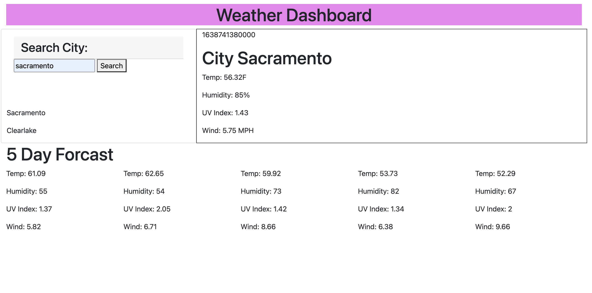

# weather-dash

This should be an app to help you understand the weather for the day and for the future forcast.

## description of the process

Still having some touble understanding how to use api's probably just need to invest more time towards grasping it. Not the best at javascript however going thru with the tutor did help me understand a little a bit more of what i should be looking for when it comes to googling how to do things. Overall my main issue with this project was not knowing what exactly to google in order to get the desired result.

### Image

#### link

https://juanjohn11.github.io/weather-dash/
